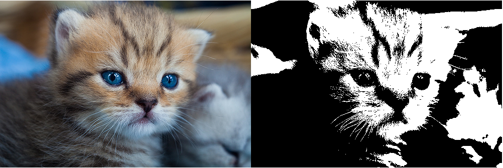

philtre
=======

Image filters in Javascript using `<canvas>`. A philtre is a [magic potion](http://en.wikipedia.org/wiki/Philtre).

install
-------

Grab `js/philtre.js`. Sample use in `js/app.js`.

Get it with [bower](http://bower.io): `bower install philtre`.

thanks to
---------

Inspired by [HTML5 Rocks image filters](http://www.html5rocks.com/en/tutorials/canvas/imagefilters/) and [MDN CSS filters](https://developer.mozilla.org/en-US/docs/Web/CSS/filter). Helpful color theory and code at [codeproject](http://www.codeproject.com/Articles/19045/Manipulating-colors-in-NET-Part-1) and [stack overflow](http://stackoverflow.com/questions/596216/formula-to-determine-brightness-of-rgb-color). Demo images via Flickr's creative commons search:

- ["Kitten" by xiaozhen](http://www.flickr.com/photos/cat-box/6262552465)
- ["Sleepy kitten being disturbed" by Magnus Bråth](http://www.flickr.com/photos/magnusbrath/5415802027)
- ["Kitten" by Tim Lee](http://www.flickr.com/photos/timylee/2764024625)

future
------

- saturate, contrast, and sepia
- convolution-based filters
